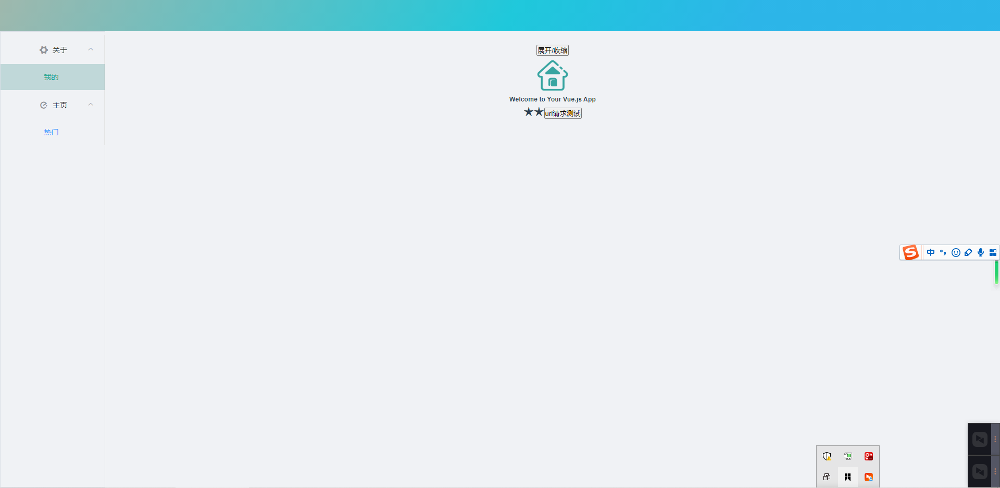

# 说明文档
一个帮助你快速搭建前端项目的脚手架【vue】

# 安装

```shell
npm install hcli -g
```
## 创建项目
目前支持Vue【vue2 + vue-cli3】

```shell
hcli create your_project_name
```

自动拉取项目模板、安装项目依赖、自动启动项目（后续优化：期间会比较耗时中间部分控制台未打印）



配置：

* 常用的目录结构
* .env.production 和 .env.development 中的baseurl和serviceurl
* vue.config.js（其中配置了别名，代理服务器）
* eslint + prettier（代码规格校验）
* sass（css预处理器）
* axios（网络请求axios的安装以及二次封装）
* vue-router（router的安装和配置，另外有路由的动态加载，后面详细说明）
* vuex（vuex的安装和配置，另外有动态加载子模块，后面详细说明）
* 集成Element框架、包括样例演示
* 基本页面布局也完成：上侧logo栏、左侧导航、中间部分主体内容展示

## 项目开发

项目开发目前提供两个功能：

* 创建Vue组件
* 创建Vue页面，并配置路由和Vuex

### 创建Vue组件：

````shell
hcli addcpn yourCpnName # hcli addcpn NavBar，默认会存放到src/components文件夹中
hcli addcpn yourCpnName -d src/pages/home # 也可以指定存放的具体文件夹
````

### 创建Vue页面，并配置路由和Vuex

```shell
hcli addview yourViewName # hcli addview Home，默认会放到src/views/home/Home.vue中，并且会创建src/page/home/router.js
hcli addview yourViewName -d src/views # 也可以指定文件夹，但需要手动集成路由
```

动态加载路由
* 创建该文件中 `src/router/index.js`中会自动加载到路由的 `routes`配置中，不需要手动配置了（如果是自己配置的文件夹需要手动配置）
`src/router/index.js`中已经完成如下操作：

```js
// 动态加载pages中所有的路由文件
const files = require.context("@/views", true, /router\.js$/);
const routes = files
  .keys()
  .map((key) => {
    const page = require("@/views" + key.replace(".", ""));
    return page.default;
  })
  .flat();
```
动态加载Vuex【同上】